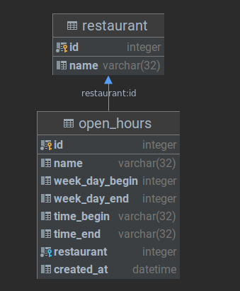
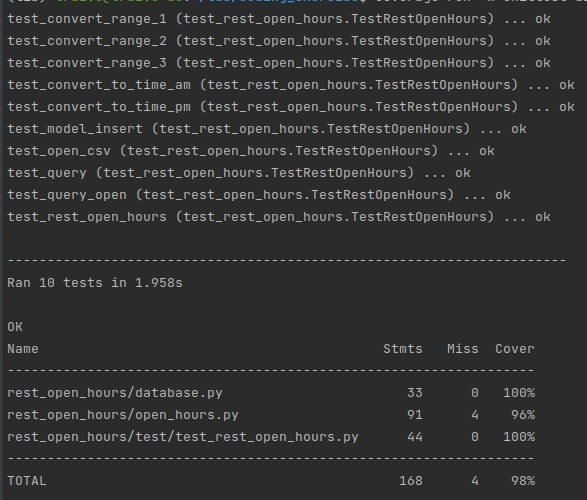

### CODING EXERCISE

This project is using sqlLite in database  and load csv file 
rest_open_hours.csv into the two tables according the diagram below:

Function that parses the data into a table

`parse_csv_into_table()`

List of restaurant names which are open on that date and time.

`list_open_restaurants(datetime.today())`

RUN TEST

`pip install -r requirement.txt`

`coverage run -m unittest discover -v rest_open_hours/test && coverage report`

RESULTS 

